# ERD Task Management

Dokumen ini disusun dari migration dan model Laravel di backend. Fokus utama ERD adalah tabel domain aplikasi; tabel sistem Laravel dan package tetap dicatat di bagian akhir.

## Mermaid ERD

```mermaid
erDiagram
    DIVISIONS ||--o{ USERS : has
    USERS ||--o{ PROJECTS : owns_as_division_owner
    PROJECTS ||--o{ MILESTONES : has
    PROJECTS ||--o{ TASKS : has
    MILESTONES ||--o{ TASKS : groups

    TASKS ||--o{ TASK_ASSIGNMENTS : assigned_to
    USERS ||--o{ TASK_ASSIGNMENTS : receives

    TASKS ||--o{ TASK_DEPENDENCIES : dependency_source
    TASKS ||--o{ TASK_DEPENDENCIES : dependency_target

    TASKS ||--o{ STATUS_HISTORIES : tracks
    USERS ||--o{ STATUS_HISTORIES : changes

    TASKS ||--o{ TIME_ENTRIES : logs_time
    USERS ||--o{ TIME_ENTRIES : logs

    TASKS ||--o{ TASK_COST_ENTRIES : has_cost
    TASKS ||--o{ TASK_PROGRESS_ENTRIES : has_progress
    USERS ||--o{ TASK_PROGRESS_ENTRIES : changes

    PROJECTS ||--o{ PROJECT_BASELINES : has
    PROJECT_BASELINES ||--o{ TASK_BASELINES : contains
    TASKS ||--o{ TASK_BASELINES : snapshotted_as

    PROJECTS ||--o{ REPORTING_PERIODS : has
    PROJECTS ||--o{ KPI_SNAPSHOTS : has
    REPORTING_PERIODS ||--o{ KPI_SNAPSHOTS : produces

    USERS ||--o{ COMMENTS : writes
    USERS ||--o{ ATTACHMENTS : uploads
    USERS ||--o{ ATTACHMENTS : verifies
    TASKS ||--o{ COMMENTS : polymorphic_entity
    PROJECTS ||--o{ COMMENTS : polymorphic_entity
    MILESTONES ||--o{ COMMENTS : polymorphic_entity
    TASKS ||--o{ ATTACHMENTS : polymorphic_entity
    PROJECTS ||--o{ ATTACHMENTS : polymorphic_entity
    MILESTONES ||--o{ ATTACHMENTS : polymorphic_entity

    ROLES ||--o{ MODEL_HAS_ROLES : assigned
    USERS ||--o{ MODEL_HAS_ROLES : model
    PERMISSIONS ||--o{ MODEL_HAS_PERMISSIONS : assigned
    USERS ||--o{ MODEL_HAS_PERMISSIONS : model
    ROLES ||--o{ ROLE_HAS_PERMISSIONS : has
    PERMISSIONS ||--o{ ROLE_HAS_PERMISSIONS : included

    USERS ||--o{ PERSONAL_ACCESS_TOKENS : tokenable
    USERS ||--o{ NOTIFICATIONS : notifiable

    DIVISIONS {
        bigint id PK
        string code UK
        string name
        text description
        string status
        timestamp created_at
        timestamp updated_at
    }

    USERS {
        bigint id PK
        bigint division_id FK
        string name
        string email UK
        timestamp email_verified_at
        string password_hash
        string job_title
        boolean is_active
        timestamp last_login_at
        string status
        string remember_token
        timestamp created_at
        timestamp updated_at
    }

    PROJECTS {
        bigint id PK
        bigint division_owner_id FK
        string name
        string client_name
        decimal value_amount
        text scope
        text objective
        date start_planned
        date end_planned
        string status
        timestamp created_at
        timestamp updated_at
        timestamp deleted_at
    }

    MILESTONES {
        bigint id PK
        bigint project_id FK
        string name
        date due_planned
        date due_actual
        string status
        timestamp created_at
        timestamp updated_at
        timestamp deleted_at
    }

    TASKS {
        bigint id PK
        bigint project_id FK
        bigint milestone_id FK
        string title
        text description
        string priority
        string status
        date start_planned
        date end_planned
        int duration_planned
        date start_actual
        date end_actual
        int duration_actual
        tinyint percent_complete
        decimal budget_cost
        timestamp created_at
        timestamp updated_at
        timestamp deleted_at
    }

    TASK_ASSIGNMENTS {
        bigint id PK
        bigint task_id FK
        bigint user_id FK
        string role_on_task
        int estimated_effort_hours
        timestamp assigned_at
        timestamp created_at
        timestamp updated_at
    }

    TASK_DEPENDENCIES {
        bigint id PK
        bigint task_id FK
        bigint depends_on_task_id FK
        string type
        int lag_days
        timestamp created_at
        timestamp updated_at
    }

    STATUS_HISTORIES {
        bigint id PK
        bigint task_id FK
        string from_status
        string to_status
        bigint changed_by FK
        text note
        timestamp created_at
        timestamp updated_at
    }

    TIME_ENTRIES {
        bigint id PK
        bigint task_id FK
        bigint user_id FK
        date date
        decimal hours
        text note
        timestamp created_at
        timestamp updated_at
    }

    COMMENTS {
        bigint id PK
        string entity_type
        bigint entity_id
        bigint user_id FK
        text content
        timestamp created_at
        timestamp updated_at
    }

    ATTACHMENTS {
        bigint id PK
        string entity_type
        bigint entity_id
        bigint uploaded_by FK
        string filename
        string mime
        string storage_path
        bigint size
        timestamp uploaded_at
        string status
        bigint verified_by FK
        timestamp verified_at
        timestamp created_at
        timestamp updated_at
    }

    PROJECT_BASELINES {
        bigint id PK
        bigint project_id FK
        string baseline_name
        datetime taken_at
        text note
        date start_planned_base
        date end_planned_base
        decimal value_amount_base
        timestamp created_at
        timestamp updated_at
    }

    TASK_BASELINES {
        bigint id PK
        bigint baseline_id FK
        bigint task_id FK
        date start_planned_base
        date end_planned_base
        int duration_planned_base
        decimal weight
        decimal planned_effort_hours
        decimal budget_cost_base
        timestamp created_at
        timestamp updated_at
    }

    REPORTING_PERIODS {
        bigint id PK
        bigint project_id FK
        date period_date
        text note
        timestamp created_at
        timestamp updated_at
    }

    KPI_SNAPSHOTS {
        bigint id PK
        bigint project_id FK
        bigint period_id FK
        int tasks_total
        int tasks_done
        int overdue_count
        decimal avg_cycle_time_days
        timestamp created_at
        timestamp updated_at
    }

    TASK_COST_ENTRIES {
        bigint id PK
        bigint task_id FK
        date incurred_on
        decimal amount
        string category
        text note
        timestamp created_at
        timestamp updated_at
    }

    TASK_PROGRESS_ENTRIES {
        bigint id PK
        bigint task_id FK
        date progress_date
        tinyint percent_complete
        bigint changed_by FK
        timestamp created_at
        timestamp updated_at
    }

    ROLES {
        bigint id PK
        string name
        string guard_name
        string status
        timestamp created_at
        timestamp updated_at
    }

    PERMISSIONS {
        bigint id PK
        string name
        string guard_name
        string status
        timestamp created_at
        timestamp updated_at
    }

    MODEL_HAS_ROLES {
        bigint role_id FK
        bigint model_id
        string model_type
    }

    MODEL_HAS_PERMISSIONS {
        bigint permission_id FK
        bigint model_id
        string model_type
    }

    ROLE_HAS_PERMISSIONS {
        bigint permission_id FK
        bigint role_id FK
    }

    PERSONAL_ACCESS_TOKENS {
        bigint id PK
        string tokenable_type
        bigint tokenable_id
        text name
        string token UK
        text abilities
        timestamp last_used_at
        timestamp expires_at
        timestamp created_at
        timestamp updated_at
    }

    NOTIFICATIONS {
        uuid id PK
        string type
        string notifiable_type
        bigint notifiable_id
        text data
        timestamp read_at
        timestamp created_at
        timestamp updated_at
    }
```

## Relasi Utama

- `divisions 1..n users`: satu divisi punya banyak user. `users.division_id` nullable dan menjadi null jika divisi dihapus.
- `users 1..n projects`: `projects.division_owner_id` menunjuk ke user sebagai owner proyek, nullable dan menjadi null jika user dihapus.
- `projects 1..n milestones`: milestone selalu milik project, dan ikut terhapus jika project dihapus.
- `projects 1..n tasks`: task selalu milik project, dan ikut terhapus jika project dihapus.
- `milestones 1..n tasks`: task boleh masuk milestone lewat `tasks.milestone_id`, nullable dan menjadi null jika milestone dihapus.
- `tasks n..m users` lewat `task_assignments`: satu task bisa punya banyak user, satu user bisa ditugaskan ke banyak task. Kombinasi uniknya `task_id + user_id + role_on_task`.
- `tasks n..m tasks` lewat `task_dependencies`: satu task bisa bergantung pada task lain. `task_id` adalah task yang bergantung, `depends_on_task_id` adalah task prasyarat.
- `tasks 1..n status_histories`: riwayat perubahan status task, dengan `changed_by` ke user yang mengubah.
- `tasks 1..n time_entries`: log jam kerja user pada task. Kombinasi `task_id + user_id + date` harus unik.
- `tasks 1..n task_cost_entries`: biaya aktual per task.
- `tasks 1..n task_progress_entries`: histori progress persen per tanggal. Kombinasi `task_id + progress_date` harus unik.
- `projects 1..n project_baselines`: snapshot rencana project.
- `project_baselines 1..n task_baselines`: snapshot rencana task dalam satu baseline project.
- `tasks 1..n task_baselines`: satu task bisa punya banyak snapshot baseline.
- `projects 1..n reporting_periods`: periode pelaporan KPI project. Kombinasi `project_id + period_date` unik.
- `reporting_periods 1..n kpi_snapshots`: snapshot KPI dibuat per periode. Kombinasi `project_id + period_id` unik.
- `comments` dan `attachments` memakai relasi polymorphic lewat `entity_type + entity_id`, jadi bisa ditempel ke entity berbeda, misalnya `Project`, `Milestone`, atau `Task`.
- `users n..m roles` dan `users n..m permissions` dikelola package Spatie Permission lewat tabel pivot polymorphic.
- `projects`, `milestones`, dan `tasks` memakai soft delete lewat kolom `deleted_at`, sehingga data bisa masuk archive dan direstore.
- `roles`, `permissions`, dan `divisions` memiliki kolom `status` untuk menonaktifkan data tanpa menghapusnya.
- `project_baselines.value_amount_base` dan `task_baselines.budget_cost_base` menyimpan snapshot biaya agar EVM cost-based bisa memakai nilai baseline. Saat baseline baru dibuat, nilai ini mengikuti total budget task aktif pada saat itu, bukan memaksa sama dengan nilai project lama.

## Catatan Tabel Sistem

- `password_reset_tokens`: token reset password berbasis email.
- `sessions`: data session Laravel jika driver session database dipakai.
- `cache` dan `cache_locks`: penyimpanan cache jika driver cache database dipakai.
- `jobs`, `job_batches`, `failed_jobs`: antrean job Laravel.
- `activity_log`: log aktivitas dari Spatie Activitylog, memakai relasi polymorphic `subject` dan `causer`.

## Catatan Desain

- Pusat data aplikasi adalah `projects`, `tasks`, dan `users`.
- `milestones` hanya pengelompokan/target waktu task, bukan tabel wajib untuk semua task karena `tasks.milestone_id` nullable.
- `comments` dan `attachments` tidak punya FK langsung ke `tasks`, `milestones`, atau `projects` karena desainnya polymorphic.
- `kpi_snapshots` menyimpan hasil hitung KPI, bukan sumber data utama. Sumber hitungnya tetap dari `tasks` dan `reporting_periods`.
- `task_baselines.baseline_id` akhirnya nullable karena ada migration yang mengubah FK menjadi `nullOnDelete`.
- Baseline bersifat snapshot historis. Task baru atau update task tidak otomatis mengubah `task_baselines` lama; perubahan masuk ke baseline hanya jika user membuat baseline baru.
- Gantt Chart membaca data task current/terbaru, sedangkan EVM baseline membaca data dari `task_baselines`.
